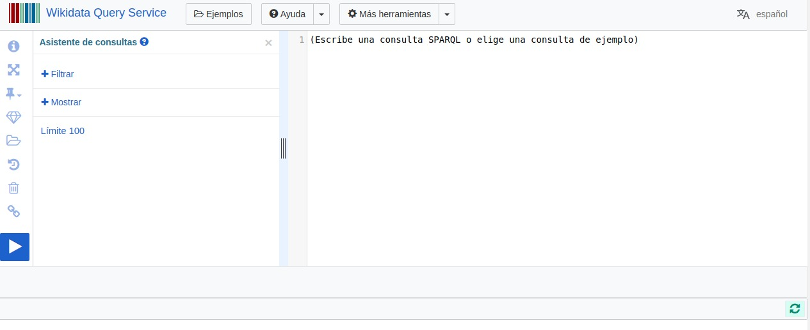
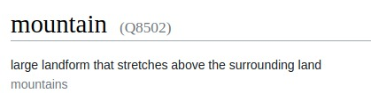
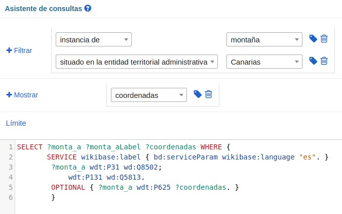
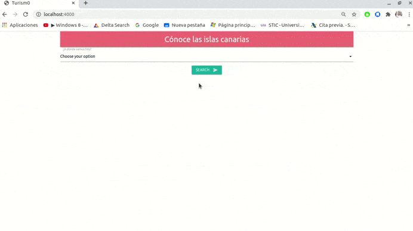

# Práctica Web Semántica

#### Alberto Martín Núñez

## Índice de contenidos

1. [Objetivo de la práctica](#id1)
2. [Aplicacion Web](#id2)
    1. [Herramientas utilizadas](#id2.1)
    2. [Metodología y Resultado Final](#id2.2)
       1. [Obteniendo los datos de wikidata](#id2.2.1)
       2. [Manipulando los datos obtenidos](#id2.2.2)
       3. [Resultado final](#id2.2.3)
3. [Conclusiones](#id3)


## Objetivo de la práctica <a name="id1"></a>

El objetivo para esta práctica consiste en construir una pequeña aplicación web que explote las consultas de **wikidata** para ofrecer un servicio en un campo concreto: turismo, economóa, seguros, aficiones, etcetera. 

Se trata de buscar una aplicacióm donde la **web semántica** sea relevante. La aplicación deberá lanzar consultas Sparql contra wikipedia y mostrar los resultados.

Para nuestro caso vamos a centrarnos en el campo del *turismo*, en donde ofreceremos una pequeña web para encontrar lugares de interés como playas y montañas de las islas canarias. De esta forma cualquier persona podría acceder y escoger que lugar visitar.


## Aplicación Web <a name="id2"></a>

A continuación se explicará las herramientas que se han utilizado para crear la aplicacion web, asi como la metodología empleada y el resultado que se ha obtenido.


### Herramientas utilizadas <a name="id2.1"></a>

Para la creación de la aplicación web he utilizado **flask**, un "micro" framework de **python** que nos permite crear de manera muy sencilla aplicaciones web usando **python** como lenguaje de programación.

Para obtener datos utilizamos **wikidata**, una base de datos abierto y gratuito que recopila datos estructurados. Para poder acceder a estos datos y lanzar consultas a la wikidata usaremos **SPARQL**, que es el lenguaje de consultas estandar.

Wikidata nos pone a nuestra disposición una aplicacion denominada *Wikidata Query Service* para realizar consultas a la propia wikidata de una forma limpia y con un asistente de consultas.



### Metológía y Resultado Final <a name="id2.2"></a>

Cómo nuestra aplicación web consistirá en ofrecer lugares de las islas canarias a los que visitar, primeramente debemos conocer de que forma podemos crear la consulta para obtener los datos que queremos representar.

#### Obteniendo los datos de wikidata <a name="id2.2.1"></a>

Nuestra consulta consistirá en obtener el nombre de las montañas y las coordenadas de la misma. De esta forma mostraremos en la web una tabla con las distintas montañas y con sus respectivas ubicaciones, las cuales, a través de un enlace nos llevará a la ubicacion de *Google Maps*

Usaremos como ejemplo el objeto *montañas* de las islas canarias para mostrar el procedimiento:




Una vez que hemos localizado el objeto importante de nuestra consulta, utilizamos el asistente de consultas de wikidata para crear la consulta y visualizar los resultamos que queremos obtener:



AHora que tenemos la consulta realizada y los datos obtenidos, wikidata nos ofrece la oportunidad de exportar el codigo para implantarlo en nuestro entorno. Una de las formas más sencillas es utilizar un **iframe** y añadirlo al *HTML*. Pero como en mi caso estoy usando *python* he escogido el codigo que nos ofrece en el propio lenguaje que en lo siguiente:

```python
# pip install sparqlwrapper
# https://rdflib.github.io/sparqlwrapper/

import sys
from SPARQLWrapper import SPARQLWrapper, JSON

endpoint_url = "https://query.wikidata.org/sparql"

query = """SELECT ?monta_a ?monta_aLabel ?coordenadas WHERE {
       SERVICE wikibase:label { bd:serviceParam wikibase:language "es". }
        ?monta_a wdt:P31 wd:Q8502;
            wdt:P131 wd:Q5813.
        OPTIONAL { ?monta_a wdt:P625 ?coordenadas. }
        }"""


def get_results(endpoint_url, query):
    user_agent = "WDQS-example Python/%s.%s" % (sys.version_info[0], sys.version_info[1])
    # TODO adjust user agent; see https://w.wiki/CX6
    sparql = SPARQLWrapper(endpoint_url, agent=user_agent)
    sparql.setQuery(query)
    sparql.setReturnFormat(JSON)
    return sparql.query().convert()


results = get_results(endpoint_url, query)

for result in results["results"]["bindings"]:
    print(result)
```

Podemos destacar la variable *query*, en donde tenemos la consulta que hemos realizado en el asistente y el método *get_results* dónde se lanza la consulta contra Wikidata.

#### Manipulando los datos obtenidos <a name="id2.2.2"></a>

Ahora que hemos obtenido los datos los manipularemos de tal forma que podamos mostrar lo necesario en nuestra web. Para ello se crea un método que recoge los datos de la consulta y devuelve un JSON con los propios datos que vamos a representar. Lo hacemos de la siguiente forma:

```python
#
### Método para devolver un JSON con los datos que queremos de las playas
#
def data_json_mountains(results):


    Mountains_JSON = {}
    Mountains_JSON['mountains'] = []

    patron = "Q.*"

    for result in results["results"]["bindings"]:
        if not (re.search(patron,str(result['monta_aLabel']['value']) )):
        
            Mountains_JSON['mountains'].append({
                'name_mountain': result['monta_aLabel']['value'],
                'coordenada': result['coordenadas']['value']
            })


    return Mountains_JSON

```

Ahora tendriamos un *json* con la siguiente estructura:

```json
{
    "mountains": [
        {
            "name_mountain": "Roque de Iguala",
            "coordenada": "Point(-17.319444444 28.058611111)"
        },
        {
            "name_mountain": "Atalaya de los Ingleses",
            "coordenada": "Point(-16.15 28.531944444)"
        },
    ]
}
```

Tenemos que comprobar que los datos que tenemos en el json son los que queremos mostrar. Por un lado es el nombre de la montaña que ya lo tenemos y por el otro son las coordenadas de la misma, pero hay un problema y es que los puntos de las coordenadas no estan sintacticamente como queremos. Para ello tenemos que hacer una transformacion al json completo modificando este campo.

Recorreremos el json para este campo de "coordenada", quitaremos todo menos los dos puntos y añadiremos una 'coma' entre ellos. Esto se hace de la siguiente forma:

```python
 ## Modificamos el campo coordenada para obtener los puntos en orden y limpios
        for item in results_parse['mountains']:
            pointStr = item['coordenada'].replace('Point(', '').replace(')', '')
            x = pointStr.split(' ')
            item['coordenada'] = createPoint(x)


```
Pero aun nos queda un error que resolver y es que los puntos estan en el orden incorrecto para ello usamos la funcion *createPoint* y les cambiamos el orden.

```python
#
### Modificamos los puntos de las coordenadas en el orden correcto
#
def createPoint(points):
    return f'{points[1]},{points[0]}'
```

Ahora ya tenemos los datos en el json para trasladarlos a nuestra web. Pare ello usamos jinja, un lenguaje de plantillas para Python de forma qiue una vez obtenido los datos los enviamos a la web de la siguiente forma:

```python
return render_template('index.html', search =search, select=select, ok=ok)
```

En donde la variable **search** son los datos obtenidos de la consulta. UNa vez que lo hemos ennviado, lo recogemos en el *inbdex.html* de la siguiente forma:

```html
        
            
            
            <table align="center">
                <tr>
                    <th> Name mountain </th>
                    <th> Google maps </th>
                </tr>
                
                
                
                <tr>

                    <td>{{mountain.name_mountain}}</td>
                    <td><a target=”_blank”  href="https://maps.google.com/?q={{ mountain.coordenada }}&ll={{ mountain.coordenada }}&z=19&t=k">Link a Google Maps</a></td-->
                </tr>
                
            </table>
            
        
    
```

Si se ha realizado una petición a wikidata y la seleccion escogida ha sido 'mountains' se crea una tabla. Usando jina recorremos las montañas con *search.mountains(la variable que le hemos pasado en el render_template) y creamos una fila para cada elemento del json con dos columnas, en una el nombre de la montaña *mountain.name_mountain* y otra con el enlace a Google Maps, en donde se añade a la url los puntos bien formateados para que el enlace sea el correcto.

*Un detalle importante es que los valores de las coordenadas no suelen ser del todo correctos y existe un poco de desviación con la ubicación que se muestra pero eso es un fallo de los propios datos que estan en la wikidata*

#### Resultado final <a name="id2.2.3"></a>

Este sería el resultado de la aplicación web. 




Como vemos podemos elegir entre *playas y montañas*, mostrando en una tabla los diferentes datos para cada selección y un enlace a Google Maps para visualizar la ubicación de la opción elegida.

*En el ejemplo hemos escogido "Mountains" y hemos seleccionado la "Montaña de Izaña".*


## Conclusiones <a name="id3"></a>

En mi opinion la Wikidata es un almacen de datos muy interesante que puede explotarse de muchas maneras y sacarle rendimiento para cualquier aplicación de una forma "simple" y totalmente gratuita. 

Bien es cierto que hay que tener cuidado con los datos que se escogen y que tenemos que entender como se relacionan los objetos con las propiedades pero eso es cuestion de seguir trabajando con los datos.